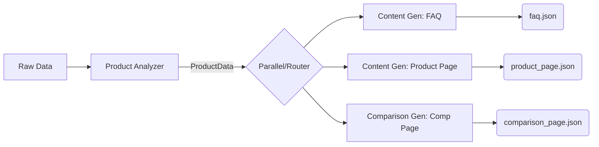
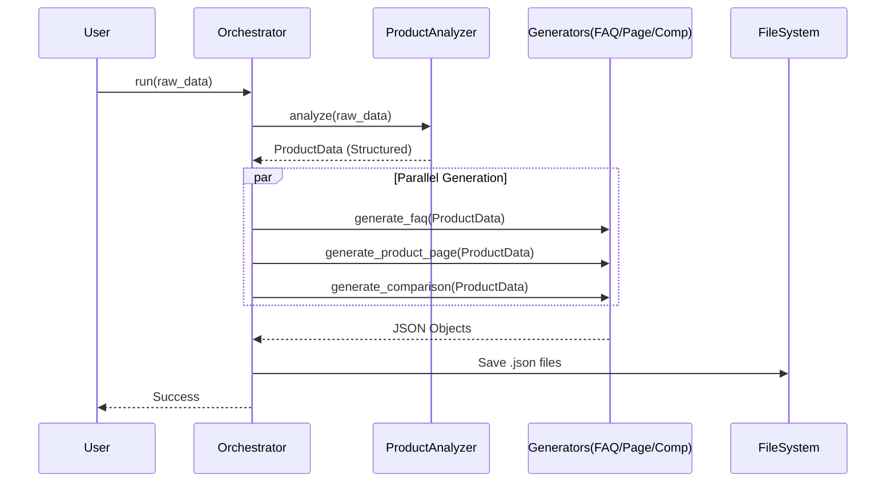

# Project Documentation

## Problem Statement
Manual creation of marketing assets (FAQs, Product Pages, Comparison Pages) from raw product data is time-consuming, inconsistent, and prone to errors. There is a need for an automated, intelligent system that can generate structured, high-quality content while strictly adhering to data constraints and formatting requirements.

## Solution Overview
The **Agentic Content Generation System** is an automated pipeline leveraging Large Language Models (LLM) to transform raw product data into structured marketing assets.
*   **Automated Extraction**: Smartly parses unstructured inputs.
*   **Parallel Generation**: Simultaneously creates FAQs, Product Pages, and Comparisons.
*   **Strict Compliance**: Uses Pydantic to ensure valid JSON outputs.
*   **Scalable Architecture**: Built on LangChain and Groq for high-performance orchestration.

## Scopes & Assumptions
### Scope
*   **Input**: Raw product attributes (name, ingredients, usage, etc.).
*   **Output**: Three distinct JSON files (`faq.json`, `product_page.json`, `comparison_page.json`).
*   **Agents**: Product Analyzer, Content Generator (FAQ/Page), Comparison Generator.

### Assumptions
*   Input data is provided in a dictionary format.
*   The "Product B" for comparisons is generated statistically/fictionally if not provided.
*   The system uses the `llama-3.1-8b-instant` model via Groq.

## System Design

### High-Level Architecture
The system follows a strictly orchestrated **LangChain LCEL Pipeline**.

### Sequence Flow
Data flows linearly with parallel execution for generation tasks.

### Component Roles
1.  **Orchestrator**: Manages the lifecycle and data flow using `RunnableSequence` and `RunnableParallel`.
2.  **Product Analyzer**: "Gatekeeper" agent. Ensures raw text is converted to a strict schema (`ProductData`), filtering noise.
3.  **Generators**:
    *   *FAQ*: specific logic for categorization and Q&A pairs.
    *   *Product Page*: Formats usage steps and copies.
    *   *Comparison*: context-aware competitor generation.
