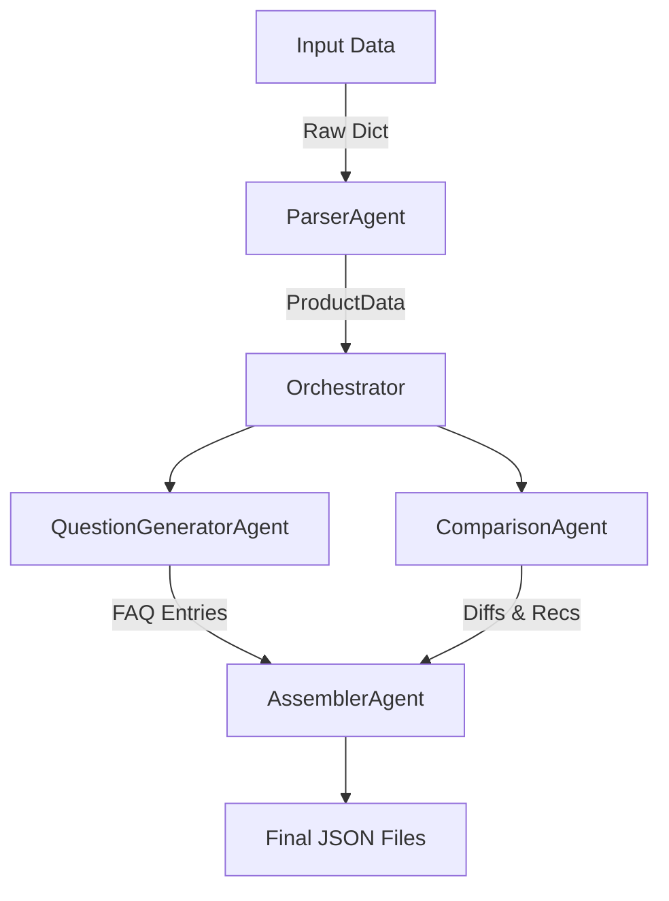
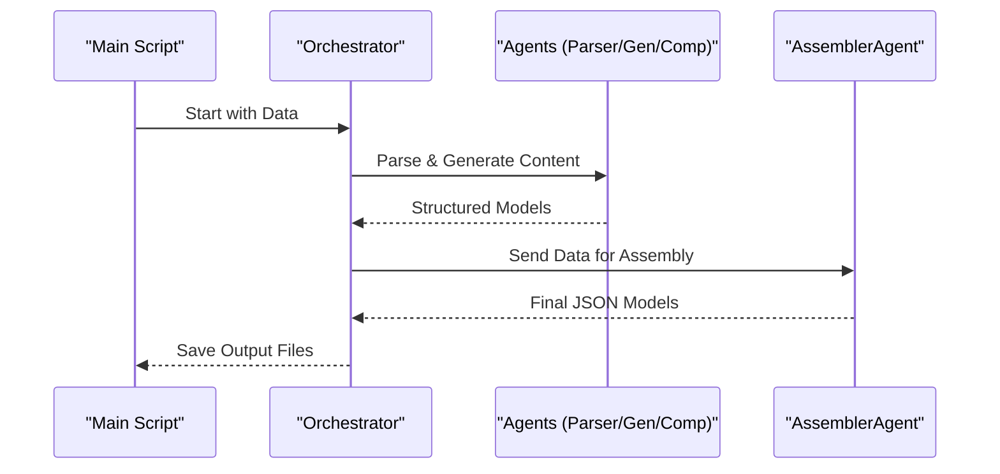

# Kasparro Multi-Agent Content System

## Problem Statement
Manual content creation is slow and inconsistent. We need an autonomous system to turn raw product data into structured JSON content (FAQ, Product Page, Comparison) without human editing.

## Solution Overview
A multi-agent pipeline that processes data in stages:
1.  **Ingest**: Clean and strictly type raw input.
2.  **Generate**: specialized agents create questions and comparison logic.
3.  **Assemble**: Combine data into key-value JSON outputs.

## Scopes & Assumptions
*   **Input**: JSON-like product dictionary (e.g., Vitamin C Serum).
*   **Output**: 3 JSON files (FAQ, Product, Comparison).
*   **Constraints**: No external research. Strict valid JSON.
*   **Assumption**: "Product B" is computationally derived (e.g., 50% price of A).

## System Design
The **Orchestrator** manages four agents to ensure strict data compliance.

### Components
*   **ParserAgent**: Enforces data types (e.g., "₹699" as string).
*   **QuestionGeneratorAgent**: Creates 15+ factual questions from data fields.
*   **ComparisonAgent**: Generates a generic "Product B" and calculates differences.
*   **AssemblerAgent**: Formats data into final JSON templates.

### Architecture

### Flow

